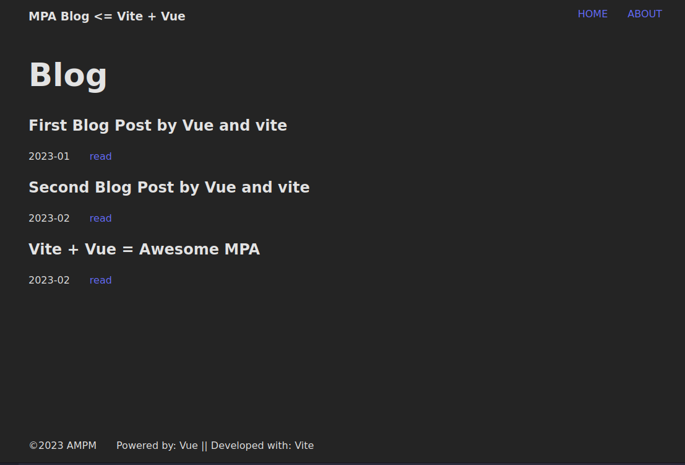
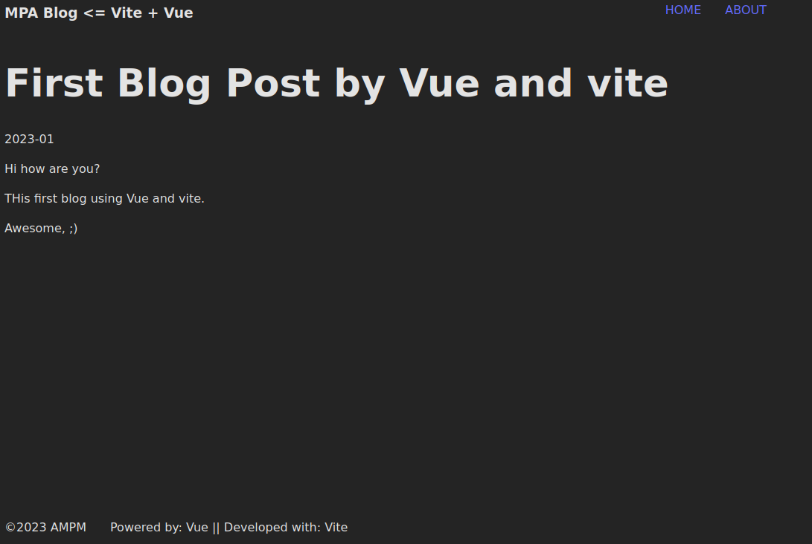

# Vite + Vue ( composition API and SFC ) => MPA

A Demo simple blog website, to show MPA (MultiPage App) with Vue ( composition API) and vite

## images

home:



detail:



## How run locally

you need:

- node >= 18.13
- npm >= 8-19.3
- just clone the project

- install deps:

```bash
    npm i
```

- run dev server :

```bash
    npm start
```

## How to build the project

```bash
    npm run build
```

### How to preview the project

```bash
    npm run preview
```
